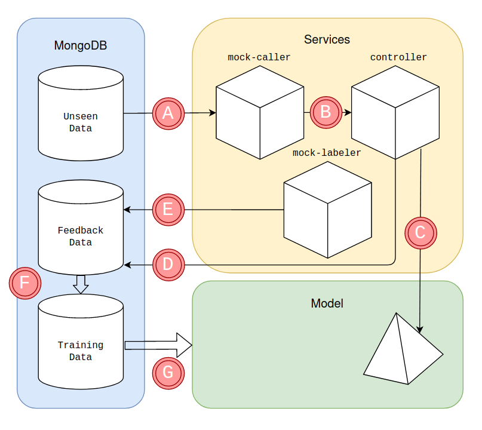

# spotify-mlops
Showcase of monitoring and retraining of Machine Learning model on Spotify data

## Architecture



* A: The database provides Unseen Data that is used by the _mock-caller_
* B: The _mock-caller_ service calls the _controller_ service for each unseen data point every x seconds
* C: The _controller_ service uses an unseen data point to gather a prediction from the deployed _model_ service
* D: The _controller_ service saves the data point and its prediction in the collection Feedback Data
* E: The _mock-labeler_ service finds all feedback data points that have a prediction but no ground truth label, it will add it and overwrite the document
* F: If a retraining is triggered, Feedback Data will also be used for model training
* G: The Training Data is used to train the model that eventually replaces the stale one inside the model service

Note: In a production scenario, the _mock-caller_ would be replaced by a client application that wants a prediction on a data point.
The _mock-labeler_ would be a backend system that determines the correct value of the predicted label.

## Data

Data is stored in a MongoDB. There are three collections:
* Training Data: Data used for model training
* Feedback Data: Data that has been predicted by the model
* Unseen Data: Data used for prediction, distinct from Training data

[Data Source](https://www.kaggle.com/yamaerenay/spotify-dataset-19212020-160k-tracks)
split into
* Training Data (1921 - 1991)
* Feedback Data (1992 - 2021)

## Services

### Controller

TBA

## Mocks

### Mock Caller

TBA

### Mock Labeler

TBA

### How to run the application

##### Required packages

Install following packages via pip (make sure to use pip3):
* `pip install flask` (APIs)
* `pip install Flask-APScheduler` (Job Scheduler for Flask with API)
* `pip install Flask-PyMongo` (MongoDB Wrapper)
* `pip install pycaret` (AutoML framework for model training)
* `pip install python-json-logger` (Structured logging for monitoring - ELK)
* `pip install data-drift-detector` (Data Drift)

#### Set up database

The application requires a NoSQL database. For local development run a MongoDB instance on port 27017. 
A convenient way would be running a Docker container of the official MongoDB image. You can pull the latest image via
`docker pull mongo`
and run a container with
`docker run -d -p 27017:27017 --name retarddb mongo`.

Run the `import-data.sh` script in order to fill mongodb with data. It requires to have the CSV files of the Kaggle dataset 
in a folder `data`.

#### Running the application

* In IntelliJ IDEA / PyCharm: Right-click on `main.py` and select `▶️ Run`.
* From the command line: Navigate to `cd src`, specify the app name and the environment `export FLASK_APP=main`, 
`export FLASK_ENV=development` or `export FLASK_ENV=production`. Finally, run flask `flask run`.
  
With `FLASK_ENV=development` the application starts on `localhost:9000`.
With `FLASK_ENV=production` the application starts on `0.0.0.0:9000`.

In order to start all services and mocks, use the docker-compose.yml by running after building all relevant Docker Images
```
docker compose up
```

## Experiment Tracking

In order to track experiment, we integrate MLFlow. For local usage please, navigate into the `traning` folder and start 
an MLFlow server which can be reached at `localhost:5000`

```
cd training
mlflow ui
```

## Serving the model

Locally from command line
```
mlflow models serve -m runs:/<RUN_ID>/artifacts -p 1234
```

Build the docker image and run a container exposing the service on port 1234
```
mlflow models build-docker -m runs:/<RUN_ID>/artifacts -n <IMAGE_NAME>
docker run -p 1234:8080 <IMAGE_NAME>
```

## Specification

### Example Request

```
curl --location --request POST 'localhost:9000/predict' \
--header 'Content-Type: application/json' \
--data-raw '{
    "acousticness": 0.8109999999999999,
    "danceability": 0.498,
    "duration_ms": 185320,
    "energy": 0.47100000000000003,
    "instrumentalness": 0.113,
    "liveness": 0.121,
    "loudness": -10.405999999999999,
    "speechiness": 0.0411,
    "tempo": 112.01799999999999,
    "valence": 0.35100000000000003,
    "year": 2020,
    "id": "5BK0uqwY9DNfZ630STAEaq"
}'
```

### Example Response

```
68.0
```

https://github.com/kelvnt/data-drift-detector